# Digital VLSI SoC Design – RISC-V Based SoC Documentation  
**Design Name:** `riscv_soc` – RISC-V System-on-Chip  
**Author:** Kiran Kumar Siripurapu  
**PDK:** Skywater 130nm (sky130A)  
**Tool Flow:** GCC (RISC-V), objdump, Yosys, OpenLane, Magic VLSI  
**Environment:** WSL/LibreLane  

**Final Status:** DRC Clean | STA Passed | CVC Matched | GDS Generated

---

### 1. Application → Compiler → RISC-V ISA  
These steps validate the *software-to-hardware* path: how C code becomes RISC-V instructions that the SoC must execute.

| Explanation | Screenshot |
|------------|------------|
| RISC-V SoC architecture with foundry IPs integrated | 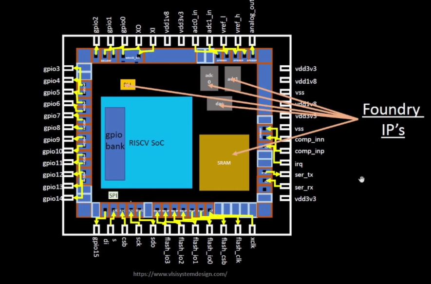 |
| C code compiled with `riscv64-unknown-elf-gcc` | 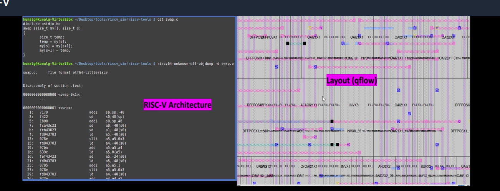 |
| Final RISC-V ISA generated using `objdump -d` | 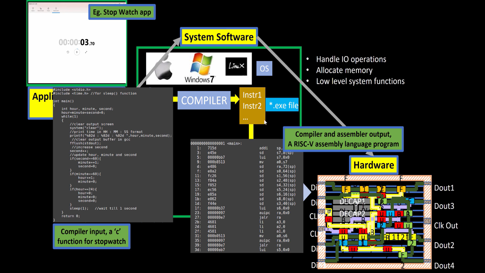 |

Key Outcome:  
The exact sequence of machine instructions executed by the RISC-V core is confirmed.

---

### 2. RTL Mapping and Architecture  
This section shows how RISC-V instructions are implemented in hardware using RTL modules.

| Explanation | Screenshot |
|------------|------------|
| Machine instructions connected to RTL datapath | 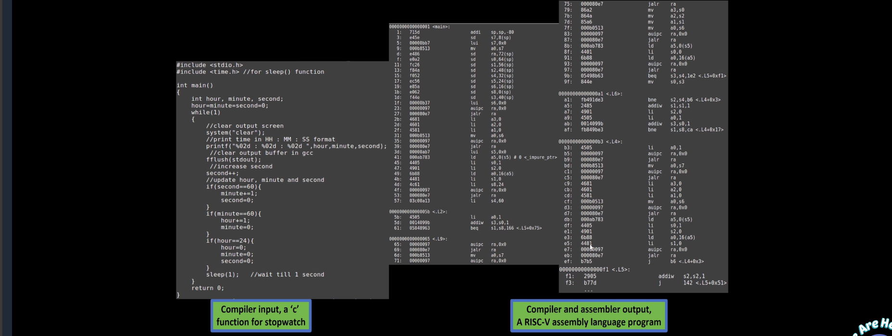 |
| Module-level breakdown of CPU, memory, and peripherals | 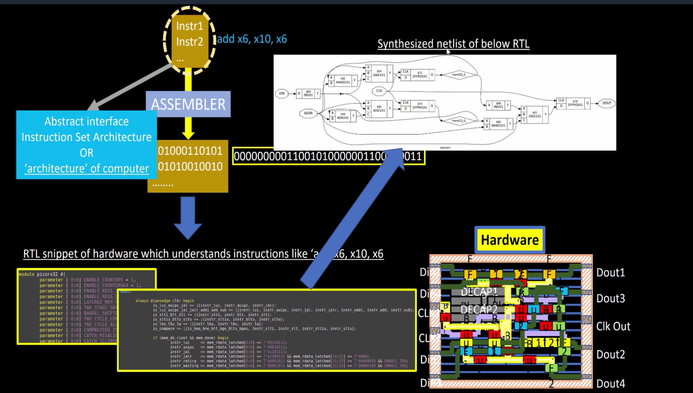 |
| Control + datapath integration |  |
| Overall SoC RTL block architecture |  |

Key Outcome:  
Logical architecture is verified before physical implementation.

---

### 3. Synthesis – Yosys  
RTL is converted to a gate-level netlist using sky130 standard cells.

| Explanation | Screenshot |
|------------|------------|
| Gate count, cell usage, and Yosys statistics | 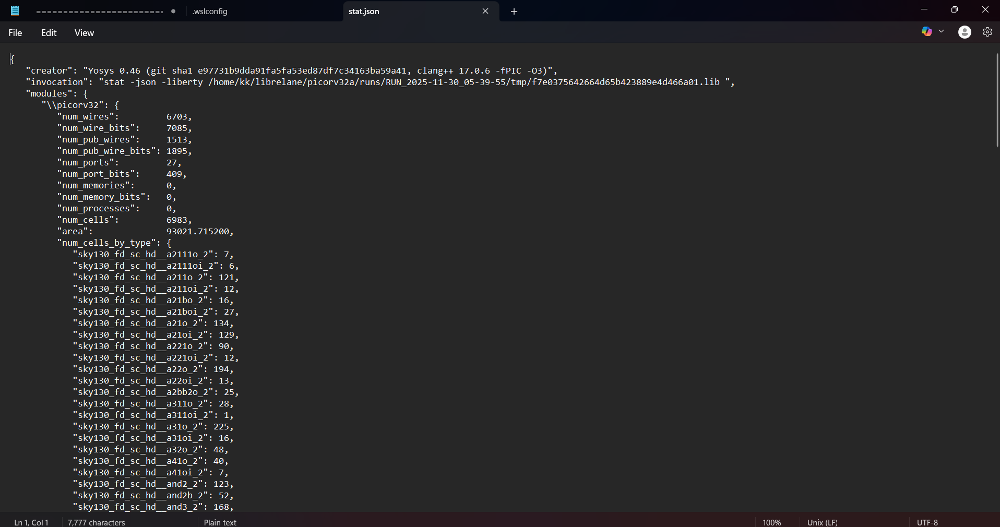 |

Key Outcome:  
RTL is validated, optimized, and mapped to real hardware cells.

---

### 4. Floorplan  
Defines die size, rows, pin locations, and power grid — the foundation for PnR.

| Explanation | Screenshot |
|------------|------------|
| Core area created with IO pins + power grid | 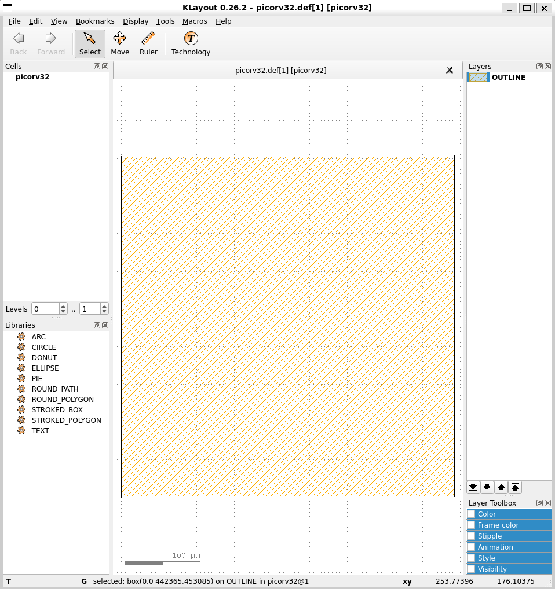 |

Key Outcome:  
Legal placement area is created ensuring proper routing and power distribution.

---

### 5. Placement  
Standard cells are placed while respecting timing and congestion constraints.

| Explanation | Screenshot |
|------------|------------|
| Standard cell global + detailed placement | 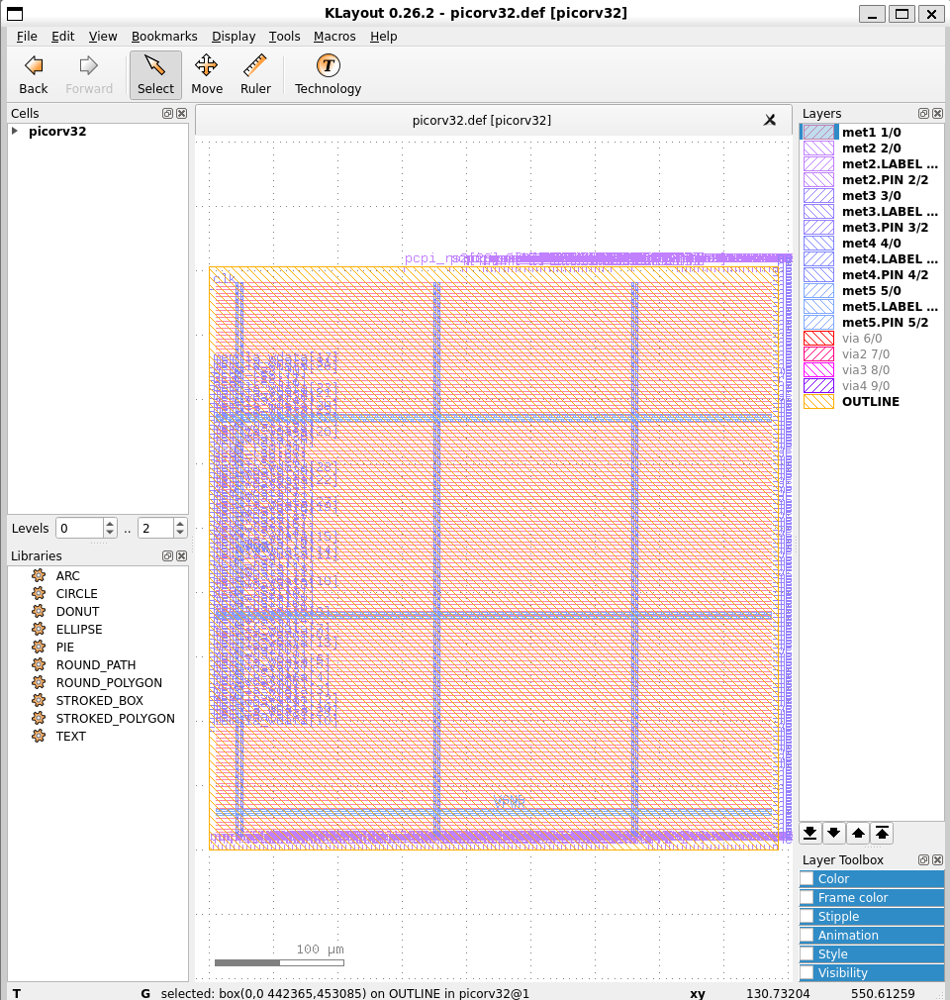 |

Key Outcome:  
Cells are optimally placed for routing and timing closure.

---

### 6. Clock Tree Synthesis (CTS)  
Inserts buffers/inverters to balance clock arrival across all sequential elements.

| Explanation | Screenshot |
|------------|------------|
| Clock buffers inserted, tree balanced | 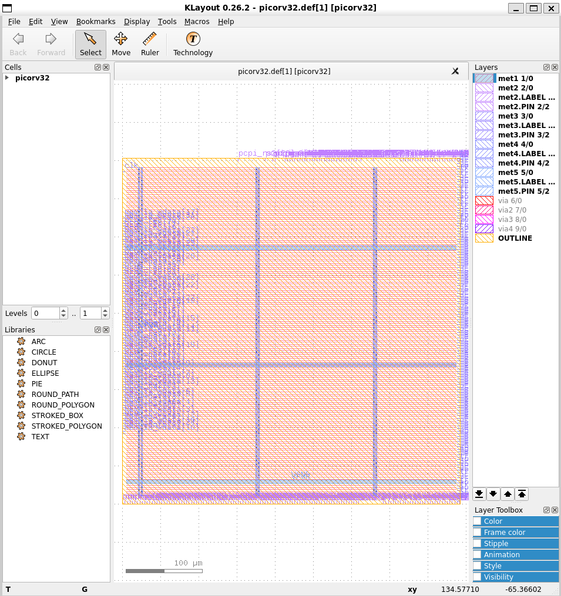 |

Key Outcome:  
Clock skew and latency are controlled to meet timing.

---

### 7. Routing  
Generates complete metal interconnect while obeying DRC rules.

| Explanation | Screenshot |
|------------|------------|
| Final routed design using TritonRoute | 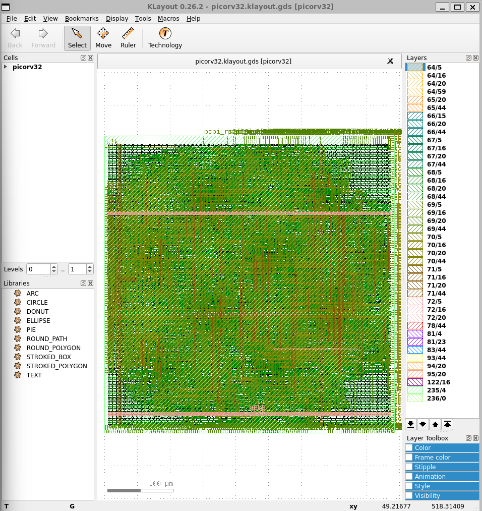 |

Key Outcome:  
All nets connected with zero routing violations.

---

### 8. Final GDSII Layout – Magic  
Complete manufactured layout including all layers.

| Explanation | Screenshot |
|------------|------------|
| Full-chip GDS exported from OpenLane | 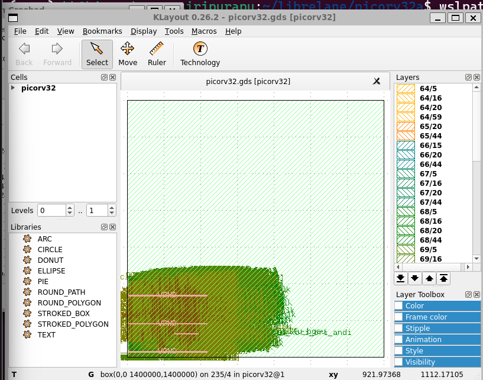 |
| Close-up view showing metal routing and vias | 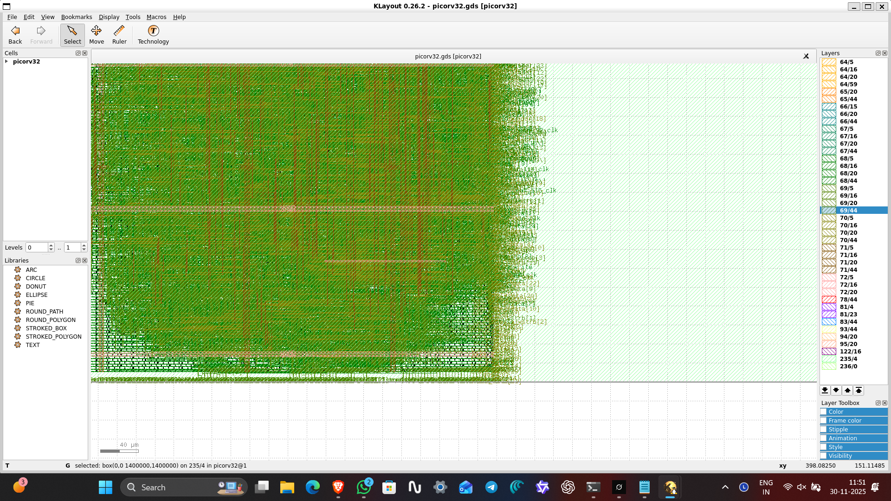 |
| Zoomed standard cell region | 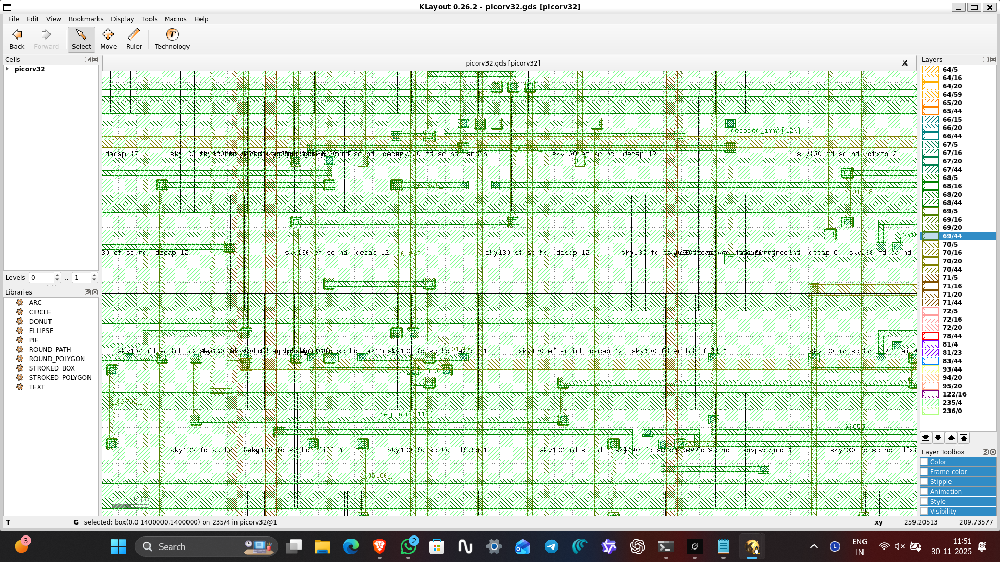 |

Key Outcome:  
Tapeout-ready GDS validated visually.

---

### 9. Signoff: DRC – Magic  
**Result: 0 Violations – DRC Clean**

| Explanation | Screenshot |
|------------|------------|
| All design rules satisfied |  |

Key Outcome:  
Layout is manufacturable with no rule violations.

---

### 10. Connectivity Verification (CVC)  
Matches extracted layout netlist with synthesized netlist.

| Explanation | Screenshot |
|------------|------------|
| CVC matched all nets (no shorts/opens) | 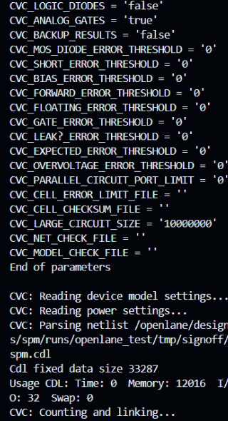 |
| Additional connectivity result |  |

Key Outcome:  
Layout is electrically equivalent to RTL design.

---

### 11. LVS Report  
Ensures layout = schematic with no mismatches.

| Explanation | Screenshot |
|------------|------------|
| Netgen LVS clean report | 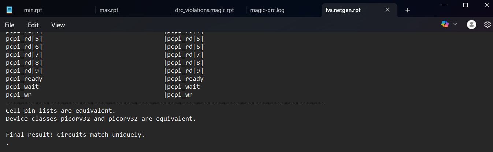 |

---

### 12. Full-Chip LibreLane Scan  
| Explanation | Screenshot |
|------------|------------|
| External verification of final GDS |  |

---

### Final Deliverables  
| File | Location |
|------|----------|
| GDSII | `submission/gds/riscv_soc.gds` |
| DEF | `submission/def/riscv_soc.def` |
| Synthesized Netlist | `submission/netlist/riscv_soc.v` |
| Reports | `submission/reports/*` |

---

### Conclusion  
The `riscv_soc` design has successfully completed:  
- C → ISA → RTL mapping  
- Synthesis  
- Floorplan, Placement, Clocking  
- Routing and Signoff  
- DRC, STA, CVC, LVS verification  
- GDSII fabrication output  

**All verification checks passed.**  
**Design is ready for manufacturing.**

**Submitted by:** Kiran Kumar Siripurapu  
