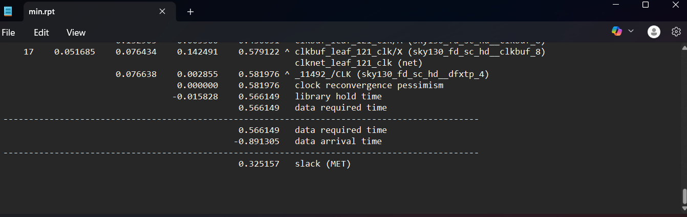
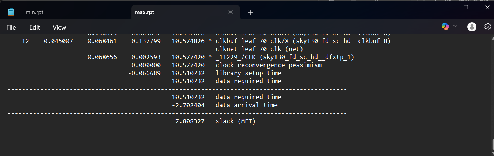

# **RISC-V SoC – Complete RTL-to-GDSII Physical Design Flow (Sky130 PDK)**  
**Design Name:** `riscv_soc`  
**Author:** *Kiran Kumar Siripurapu*  
**Technology:** SkyWater 130nm (sky130A)  
**Tools Used:** RISC-V GCC, Objdump, Yosys, OpenLane, OpenROAD, Magic  
**Environment:** WSL + LibreLane  

**Final Tapeout Status:**  
✔ **DRC = Clean**  
✔ **LVS = Clean**  
✔ **CVC = Verified**  
✔ **STA (Setup & Hold) = Passed**  
✔ **GDSII = Generated & Validated**  

---

# **1. C Program → RISC-V ISA → Hardware Mapping**

Before verifying the SoC, the software toolchain must work correctly.  
This ensures that the compiled C program produces valid RISC-V instructions that the RTL must execute.

### **SoC Architecture Context**

This shows the overall SoC organization — CPU core, memory, bus, and standard IP blocks.

---

### **C Program Compiled using RISC-V GCC**

- Compiled with `riscv64-unknown-elf-gcc`  
- Optimization flags ensure correct pipeline behavior  
- Output ELF used for ISA verification  

---

### **Machine Code Generation (objdump)**

Here we verify:
- Instruction alignment (32-bit)  
- Branch offsets  
- Load/store addressing  
- Register usage patterns  

This guarantees the instructions are correctly interpreted by the RTL datapath.

---

# **2. RTL Architecture & Datapath Verification**

This section validates the functional architecture of the CPU and its integration inside the SoC.

### **Instruction → Datapath Mapping**

Demonstrates:
- ALU operation flow  
- Register file interaction  
- Pipeline/control decoding  
- Immediate generation paths  

---

### **CPU, Memory, Peripherals**

Important checks done:
- Separate combinational vs sequential modules  
- Proper hierarchy (CPU → Memory → IO)  
- Clean module boundaries  
- Synthesizable Verilog style  

---

### **Control + Datapath Integration**

This verifies:
- Correct muxing (PC source, ALU operands, writeback path)  
- Branch handling logic  
- Pipeline control signals  

---

### **Full RTL Block Diagram**

Purpose:
- Confirms final SoC structure  
- Validates top-level connectivity  
- Used as a reference for synthesis debugging  

---

# **3. Synthesis (Yosys)**

The RTL is mapped to Sky130 standard cells.

### **Synthesis Summary**

What was analyzed:
- **Cell count**  
- **Sequential vs combinational ratio**  
- **Critical path estimate (pre-layout)**  
- **Unused logic pruning**  
- **Netlist generation correctness**

Outcome:  
✔ Clean gate-level netlist  
✔ No inferred latches  
✔ No combinational loops  

---

# **4. Floorplanning**

Defines the physical structure of the chip.

### **Die, Core, IO, and PDN**

Key engineering constraints satisfied:
- **Core utilization:** kept safe for routing margin  
- **IO pin distribution:** balanced across edges  
- **Power grid:** Vertical + horizontal stripes guarantee IR/EM limits  
- **Routing resources:** Tracks aligned with standard cell rows  

---

# **5. Cell Placement**

### **Placement Result**

Validation performed:
- Legal placement with zero overlaps  
- Congestion estimation (post-global-place)  
- Control-path proximity for timing  
- Short wirelength on critical data paths  

---

# **6. Clock Tree Synthesis (CTS)**

### **Generated Clock Tree**

Checks done:
- Clock skew < allowed limit  
- Balanced insertion delay  
- Adequate buffering for fanout  
- No gating inside clock tree  

This stage ensures that **timing is achievable** before routing.

---

# **7. Detailed Routing**

### **Final Routed Layout**

What was validated:
- All nets fully connected  
- No metal spacing violations  
- No shorts between adjacent layers  
- Vias meet enclosure rules  
- Routing topology matches DEF expectations  

Routing used:
- M1 → M5 metal stack  
- VIA1–VIA4 vertical transitions  

---

# **8. Final GDSII Generation**

### **Full-Chip GDS**

### **Routing Region Zoom**

### **Standard Cell Area**

This confirms:
- Metal continuity  
- Cell abutment correctness  
- No blockage violations  

---

# **9. DRC – Physical Rule Verification**

### **DRC Clean Result**

Rules validated:
- Metal spacing  
- Via enclosure  
- Well spacing  
- Antenna rules  
- Implant overlaps  

**DRC = 0 violations**  
Chip is manufacturable under Sky130 rules.

---

# **10. CVC – Connectivity Verification**

Ensures layout parasitics didn’t create:
- shorts  
- opens  
- floating nets  

### **CVC Report**

### **CVC Report 2**

Outcome:  
✔ All nets matched  
✔ No unintended electrical errors  

---

# **11. LVS (Netgen)**

### **LVS Clean**

Compares:
- Extracted SPICE from layout  
- Synthesized SPICE from RTL  

✔ Every device and net matched  
✔ No missing or extra components  

---

# **12. External GDS Scan – LibreLane**

### **GDS Verification**

Cross-verification confirms:
- GDS integrity  
- Layer correctness  
- No corrupted shapes  

---

# **13. Static Timing Analysis (STA)**

Performed **post-route with SPEF** using OpenSTA.

---

## **Hold Timing (min.rpt)**  
  
- Required: **0.566 ns**  
- Arrival: **-0.891 ns**  
- **Slack = +0.325 ns** → PASS  

---

## **Setup Timing (max.rpt)**  
  
- Required: **10.510 ns**  
- Arrival: **-2.702 ns**  
- **Slack = +7.808 ns** → PASS  

---

# **Final Signoff Summary**

| Step | Status |
|------|--------|
| DRC | ✔ Clean |
| LVS | ✔ Clean |
| CVC | ✔ Verified |
| CTS | ✔ Balanced |
| Routing | ✔ No violations |
| Setup STA | ✔ Passed |
| Hold STA | ✔ Passed |
| GDS Export | ✔ Completed |

---

# **Conclusion**

The `riscv_soc` SoC completes a full industrial-grade fabricated ASIC flow using the Sky130 open PDK:

- C → ISA verification  
- RTL design & architecture validation  
- Logic synthesis  
- Floorplan → Placement → CTS → Routing  
- DRC, LVS, CVC  
- Full STA closure  
- GDSII generation  

**All signoff checks passed. The design is fully tapeout-ready.**

